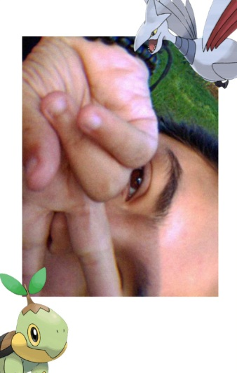

## Esta es una pagina relacionada a la historia de Valentina

### Cuentos de un amor joven

Eran los mediados de los 80s, el verano iniciaba, la brisa alborotaba el cabello de todos aquellos valientes que se atrevieran a enfrentarse al sol abrasador, la vista de Cuajinicuilapa desde Loma del Carmen era hermosa, se podia ver desde ahi todo el pueblo e incluso hasta la costa en los dias mas despejados, en este pequeño pueblo en crecimiento existio una joven llamada Becca, una chica de piel tostada, ojos marrones, cabello cual ollin, con un pantalon corto, holgado, y malgastado, una vieja camiseta ligera y un par de guaraches blancos por ropa, su sombra se pintaba en la vegetacion de la cima de la Loma, se sento bajo un guanacaste, bajo aquel frondoso arbol saco su almuerzo, que consistia de mango y pepino cortados en trozos con tajin espolvoreado, y un libro titulado “Pedro Paramo”, su mejor amigo se lo habia prestado, lo habia tomado de contrabando de la oficina de su padre, mientras leia y comia el sol se ocultaba, al atardecer decidio que era hora de volver, de colina abajo vio a su mejor amigo, y prometido, Santiago venia corriendo mientras gritaba.
“¡Becca, Becca! Te tengo un chisme” - le tomo por los hombros y le dijo con un entusiasmo irreal - ¡Llego alguien nuevo Becca! - apenas pudo mencionar por el cansancio de haber corrido desde el hotel de costa

Becca lo miro con una mirada curioso y nego con la cabeza

¿Y es por eso que vienes corriendo?, Aqui viene gente de todos lados Santi, tu deberias saberlo mejor que nadie, te la pasas en la costa todo el tiempo, has de ver gringos nuevos todo el tiempo -Dijo ya cansada del teatro que Santiago habia causo por, lo que creia ella, era solo un visitante mas

Santiago rodo los ojos y se sento en una roca cercana

Tu no lo entiendes por que no le has visto, era una muchacha hermosa y venia con un chico de muy buen ver, yo creo que era su prometido, porque no se parecian en nada - Explico con hartazgo Santiago, sabia que aunque Becca lo viera no le interesaria, pero a el si, nunca pasaba nada nuevo en el pueblo, lo mas interesante que habia pasado en meses era que su hermana Maria del Carmen se habia casado, su prima Guadalupe estaba de novia con un extranjero que venia de visita y por supuesto, que el se habia comprometido con Becca

Becca suspiro - Bien, te creere - Expreso y siguio el camino hacia el pueblo, mientras tanto Santi se quedo perplejo sentado en la piedra - ¿Y bien? Vamos a darle la Bienvenida a los nuevos visitantes -Grito esperanto que Santi se moviera

Santi escapo del shock y fue corriendo a con becca, entusiasmado por poder teorizar con ella sobre que haran ahi - ¡Esperame entonces! - Grito y corrio para alcanzar a Becca, empujandola levemente cuando estuvo a su lado

Becca por su parte rodo los ojos y pidio llevar el camino en silencio, lo que inevitablemente desanimo a Santiago (el cual accedio a regaña dientes), si bien eran mejores amigos y estaban comprometidos, no se soportaban en lo mas minimo algunas veces, Santiago era palarchin, ruidoso, energetico, y un deportista avido, sin mencionar que su padre era el dueño de los complejos hoteleros en el que trabajaba la madre de Becca, Becca por otro lado era introspectiva, no era mucho de hablar, era lo que llaman un “Raton de biblioteca”, devoraba libros enteros una y otra vez, para estas alturas ya habia leido la misma biblia tres veces, de vez en cuando nadaba, vivia en el centro del pueblo a duras penas y apenas podia darse una educacion, su madre trabajaba como ayudante de cocina para el padre de Santi, mientras que su padre trabajaba en las minas de las ciudades adyacentes, depende de a donde lo mandara el patron, cada fin de mes mandaba dinero, a excepcion de cuando enfermaba de gravedad. A pesar de sus grandes diferencias Becca y Santiago se hicieron mejores amigos, se conocieron desde niños, y hasta ahora (Con Becca ya con 15 y Santiago 17 años) seguian siendo amigos e incluso se comprometieron, por sorpresa de nadie, si bien su compromiso no fue sorprendente persee, lo que si sorprendio al pueblo fue que la mismisima Becca en su fiesta de 15 años pidiera matrimonio publicamente a Santiago, todo el pueblo hablo de ello por semanas, los padres de Santiago sorpendentemnente apoyaron el matrimonio, y aun mas sorprendentemente, el padre de Becca se opuso, alego que no les daria la mano de su hija ni por todo el dinero del mundo, Becca y su madre tardaron meses en convencerlo, pero por fin cedio, la dio al modico precio de la promesa que lo unico que le faltaria a Becca serian penurias. A pesar del resiente compromiso, a Becca y a Santiago no les gustaba el otro, estaban comprometidos por mera conveniencia, Becca sabía que necesitaba encontrar un marido pronto o la casarían con quién fuera, mientras que Santiago necesitaba una esposa para poder heredar el complejo hotelero, si bien no se lo darían a su hermana, sabía con certeza que se lo darían a algún trabajador de su padre si no se casaba pronto.

Después de una larga caminata finalmente llegaron al hotel de la costa, el “Costa Dorada”, vieron a un aglomerado de personas en la entrada y Becca supo de inmediato que aquellos visitantes no eran cualquier persona, Santiago la tomo de la mano y la dirijo entre la personas, entrando finalmente al hotel, cuando entraron Becca lo entendió todo, si bien solo eran 3 personas, cada uno era más fascinante que el anterior, primero vio a un hombre, de edad ya un poco avanzada, le calculaba unos cuarenta años, tenía el pelo negro semi-canoso, un traje meticulosamente arreglado, una nariz ligeramente aguileña, labios un poco delgados, unos ojos verdes olivo penetrantes, piel lechosa con pocas arrugas y un semblante serio, lo que le daba un porte que lo hacía bastante difícil de ignorar, por más que Becca quisiera negarlo, ese hombre era bastante atractivo, le cautiva solo verlo, de ver a aquel hombre su mirada paso a un joven alto, también vestía un traje, tenía el pelo dorado y la piel blanca, ojos azules, labios delgados, semblante jovial y una figura delgada, el también era bastante bello, y después la mirada de Becca paso a una chica, y entonces el mundo entero de Becca se detuvo, entendió totalmente la euforia de Santiago, aquella chica era totalmente y simplemente hermosa, pelo negro cuál ebano, largo y lacio, ojos verdes cuál esmeraldas, piel clara con una ligeras pecas en su rostro, labios rojos, un vestido rosa pastel y con pequeñas flores blancas bordadashasta las rodillas, tacones bajos de color negro, semblante serio y el mismo porte de aquel hombre que había visto al principio, no pudo evitar quedar cautivada ante su belleza, parecía una princesa de los cuentos que le contaba su madre cuando era pequeña.

Santi… ¿Quien es… ella? - Becca apenas atino a preguntar, había quedado tan hechizada por la figura de la chica que apenas y le salían las palabras

Santiago río y nego posando su mano en el hombro de Becca
Ella, Becca amiga mía, es la visitante que te había dicho - Dijo divertido, nunca podría decir con exactitud lo divertido que era molestar a Becca

Becca giro los ojos y quitó la mano de Santiago de su hombro - Vamos, hay que hablarles - Dijo con seguridad y tomo del brazo a Santi, lo arrastró hacia adentro del hotel camino hacia los visitantes, se plantó frente a ellos y le dio un pequeño codazo a Santiago para que se presentará.

Santiago apenas pudo pararse correctamente cuando Becca ya estába pidiendo que se presentará, suspiro cansado y se plantó junto a Becca a regaña dientes.
Buenas tardes señor, mi nombre es Santiago De Marco, dueño de este hotel, ella es mi prometida Becca, podría decirnos que lo trae a nuestro hotel - Dijo Santiago con cordialidad, tomando a Becca de la cintura y sonriendo amablemente

El hombre sonrió y extendió su mano esperando un saludo, el cual si llego

Mucho gusto joven De Marco, soy un viejo amigo de su padre, me llamo Gregorio Martínez, ella es mi hija Eireann Martínez, y el es su prometido, Michael Smith - dijo el hombre, presentando a sus acompañantes

El mundo de Becca sufrió un revoltijo de emociones, por un lado está increíblemente feliz, sabía el nombre de la chica más hermosa que había visto, pero también se había enterado que estaba comprometida, atino a dar un saludo cordial, pero aún así no podía evitar sentir recelo por el prometido de Eireann.

Eireann por su parte, juraba que sería un verano aburrido, encerrada con su padre y su aburrido prometido en un aburrido hotel en un pueblo aún más aburrido, pero cuando se preparaba para pasar el peor verano de su vida la vio, una joven de piel canela, pelo negro, y ojos marrones, con solo verla ya se daba cuenta de lo libre que era, Eireann nunca había usado pantalónes, pero Becca se miraba tan cómoda que noto en seguida que los usaba habitualmente, su cabello alborotado le causó tanta envidia y fascinacion a Eireann, que no podía quitarle la mirada de encima.

Aquella tarde y no muchas cosas más pasaron, Becca y Eireann apenas y hablaban, un día Eireann salió a caminar por la playa y descubrio a Becca en la orilla del mar, parecía melancolica, se acercó a ella y por primera vez desde que llegó, la conoció de verdad, hablaron por horas, Becca le contó que realmente no le gustaba Santiago, se comprometió con él para no casarse con un vago o algo parecido, para poder seguir en su pueblo junto a su madre y padre, después Eireann le contó sobre su vida, el como solo había tenido educación en casa, como se comprometió con su (según sus propias palabras) insípido prometido y lo ahogada que se sentía por él, su padre, también le contó cómo había perdido a su madre y su padre nunca volvió a ser el mismo. Pasaron los días, las semanas y los meses, hasta que el mismo verano termino, y la estadía de Eireann terminó, y antes de irse Becca la llevo a la Loma del Carmen, y ahí, a la vista de el atardecer, le confesó su amor, Eireann la correspondió, pero su amor no podía ser, así que nunca pudieron ser lo debieron ser. Ambas hicieron una vida, Eireann se casó con Michael y tuvieron un matrimonio más o menos bueno, tuvieron 3 hermoso hijos, 2 niños y 1 niña, mientras que Becca se casó con Santiago y tuvo dos hijos, un niño y una niña.

Años después, con la edad de Becca ya muy avanzada, llegó Eireann, con la promesa de cumplir porfis el amor que se habían prometido años atrás, pasaron sus últimos años a los pies de la Loma del Carmen, si bien vivían en el centro del pueblo, casi nunca estaban en casa, hasta que el tiempo en esta tierra de Becca y Eireann se acabaron.

### Autora: Valentina

